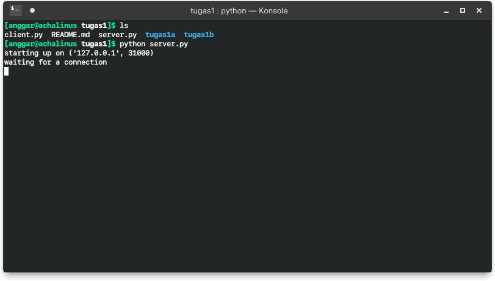
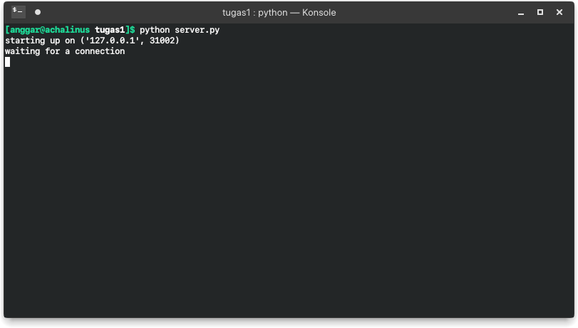
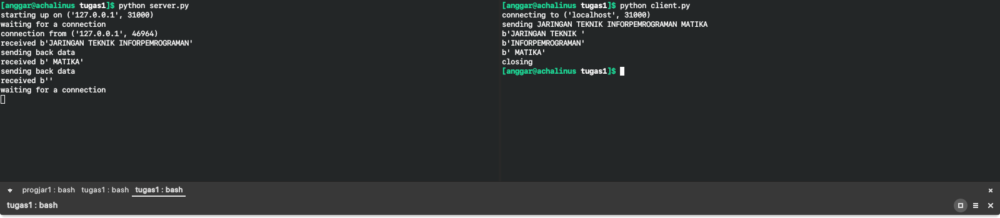
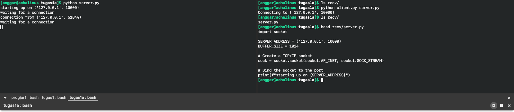
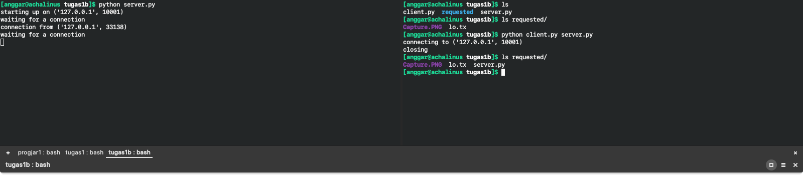

## Simulasi 1

> Jalankan program server.py di 3 port yang berbeda (31000, 31001, 31002).

*Server bekerja pada port 31000*

*Server bekerja pada port 31001*

*Server bekerja pada port 31002*

Untuk mengubah port pada kode `server.py` baris 6 ubah nilai kedua pada *tuple*

## Simulasi 2

> Jalankan program client.py untuk konek ke server yang jalan pada poin sebelumnya dan mengirimkan string “JARINGAN TEKNIK INFORPEMROGRAMAN MATIKA”.

Pada berkas `client.py` ubah variabel `message` sesuai dengan nilai yang ditentukan di atas.

*Server dan client bekerja pada port 31000*

*Server dan client bekerja pada port 31001*

*Server dan client bekerja pada port 31002*

## Simulasi 3

> Jalankan program server.py di 3 port yang berbeda di 2 komputer yang berbeda.

Untuk komputer saya program berjalan seperti simulasi pertama.

Untuk program yang berjalan pada komputer lain ditangkap tangkapan layar berikut

## Simulasi 4

> Jalankan program client.py untuk konek ke server pada poin sebelumnya, kirimkan string yang sama.

Pada program klien akan dijalankan menjadi seperti ini.

Sehingga menghasilkan keluaran pada program di server pada komputer berbeda.

## Simulasi 5

Mirip simulasi ketiga.

## Soal A

> MODIFIKASILAH program client.py dan server.py agar dapat MENTRANSFER file dari client ke server (letakkan program modifikasi di direktori tugas1a).

## Soal B

> MODIFIKASILAH program server.py agar dapat mengirimkan MENTRANSFER FILE yang di request oleh client (letakkan program modifikasi di direktori tugas1b).

