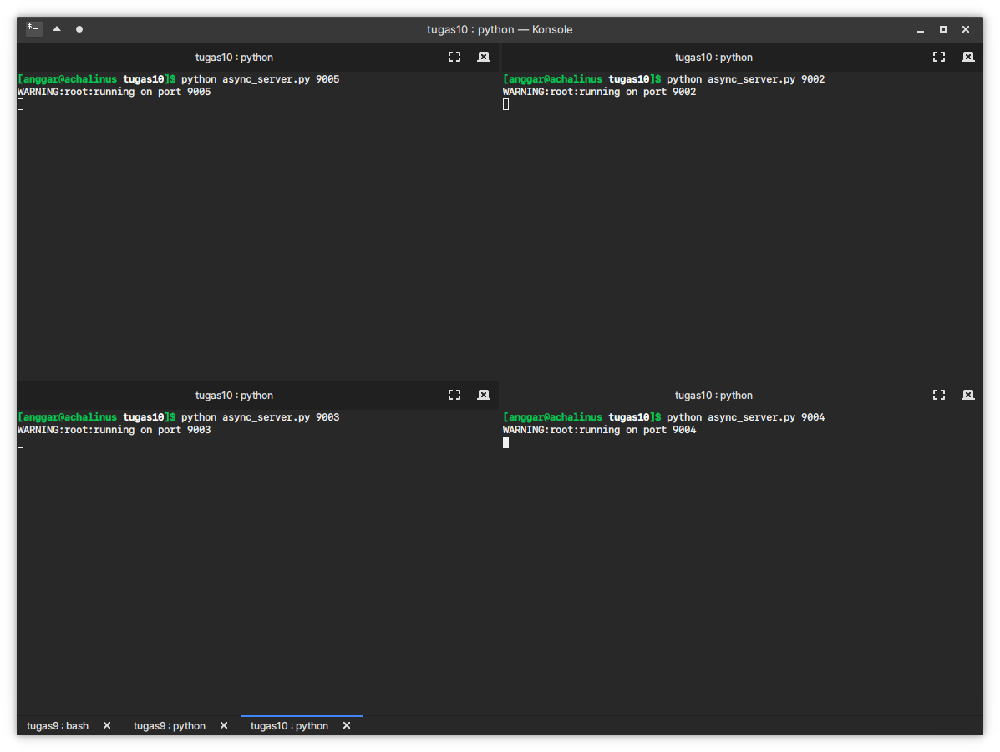
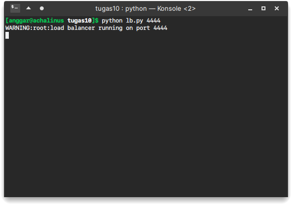
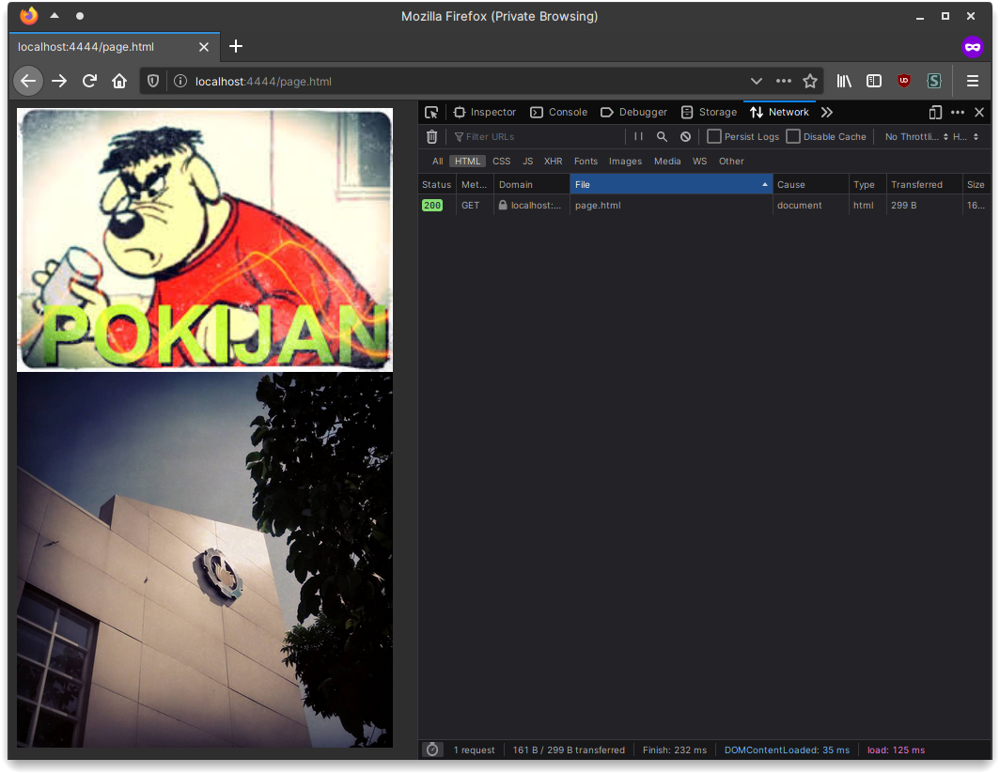
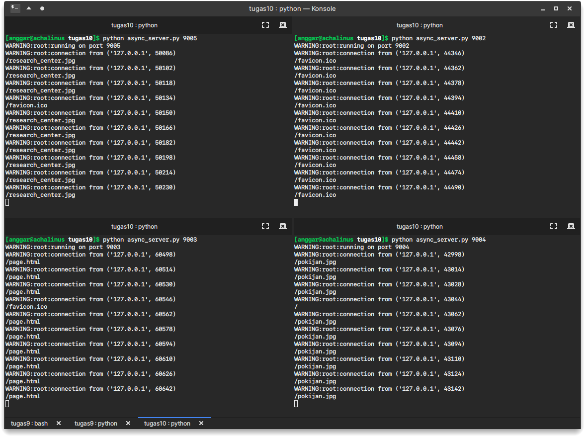

# Tugas 10

## Benchmarking

Benchmarking menggunakan `apachebencmark` dengan melakukan 1000 request. Test script ada di berkas `test.sh`. Hasil dapat dilihat di `result.txt`

## Screenshots

## Result

| # | Concurrency level | Time taken for test | Complete request | Failed request | Total transferred | Requests per second  | Time per request | Transfer rate     |
|---|-------------------|---------------------|------------------|----------------|-------------------|----------------------|------------------|-------------------|
| 1 | 1     | 1.437 seconds | 1000 | 0 | 29800 bytes | 696.06 [#/sec] (mean) | 1.437 [ms] | 202.57 [Kbytes/sec] |
| 2 | 10    | 0.679 seconds | 1000 | 0 | 29800 bytes | 1472.51 [#/sec] (mean) | 0.679 [ms] | 428.52 [Kbytes/sec] |
| 3 | 50    | 0.636 seconds | 1000 | 0 | 29800 bytes | 1571.59 [#/sec] (mean) | 0.636 [ms] | 457.36 [Kbytes/sec] |
| 4 | 100   | 0.602 seconds | 1000 | 0 | 29800 bytes | 1660.06 [#/sec] (mean) | 0.602 [ms] | 483.10 [Kbytes/sec] |

## Conclusion

Jika dibandingkan dengan hasil sebelumnya pada [tugas 9](../tugas9/README.md) di subbagian *thread* terlihat perbedaan yang signifikan. Di mana dengan menggunakan konstruksi *async*  akan menghasilkan performa yang lebih baik dan merata pada semua level konkurensi.