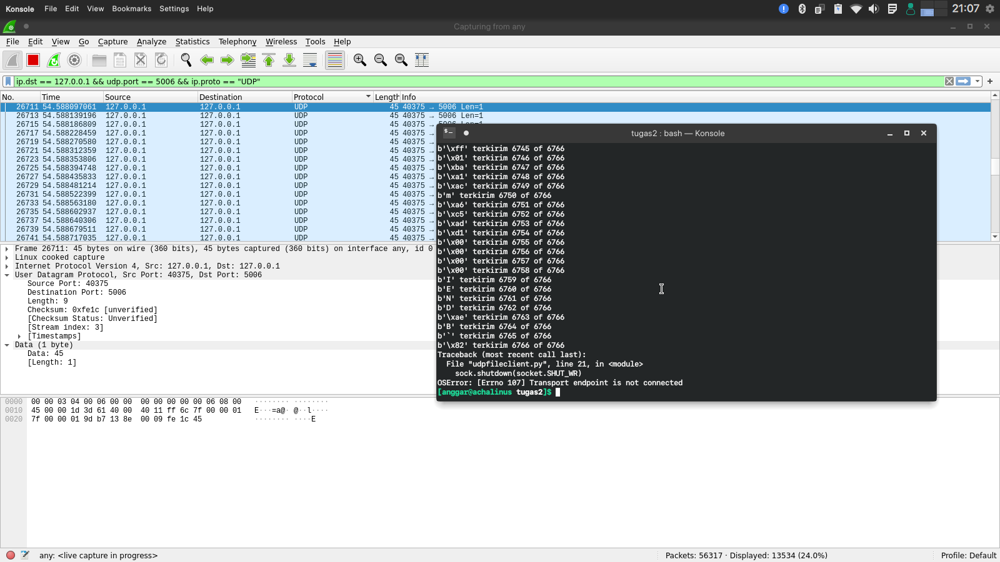
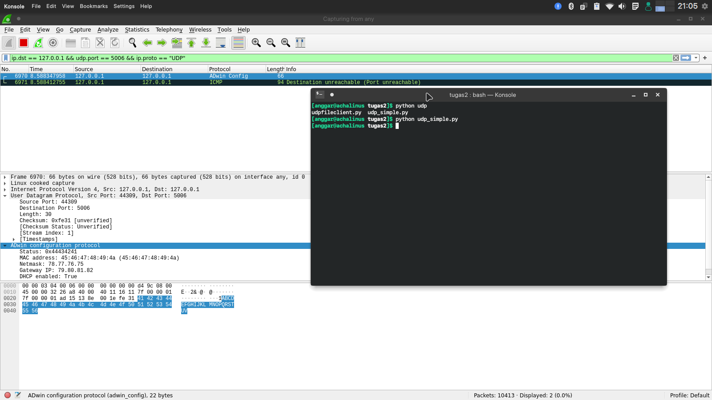

Nama  : Anggar Wahyu Nur W<br>
NRP   : 05111740000052<br>
Kelas : C

### Soal 1

Menggunakan wireshark, capture hasil keluaran dari program `udpfileclient.py` ke alamat **127.0.0.1** ke port **5006**.

> Di sini berkas yang akan dikirim adalah "test.txt".

Pada `udpfileclient.py` tambahkan mekanisme untuk menutup hak *write* pada objek socket.

```py
# shutdown the socket
sock.shutdown(socket.SHUT_WR)
```

- **Filer** pada wireshark

    ```
    ip.dst == 127.0.0.1 && udp.port == 5006
    ```

- Tangkapan setelah program dijalankan

    

    Gambar di atas merupakan paket-paket yang terkirim melalui UDP port 5006. Karena kita mempartisi file menjadi paket-paket berukuran 1 byte, maka data yang muncul juga 1 byte (1 karakter).

### Soal 2

Menggunakan wireshark, capture hasil keluaran dari program `udp_simple.py` ke alamat **127.0.0.1** ke port **5006**.

- **Filter** pada wireshark

    ```
    ip.dst == 127.0.0.1 && udp.port == 5006
    ```

- Hasil capture setelah program dijalankan

    

    Dapat dilihat pada teks yang terseleksi bagian bawah, data yang terkirim sesuai ("ABCDEFGHIJKLMNOPQRSTUVWXYZ").