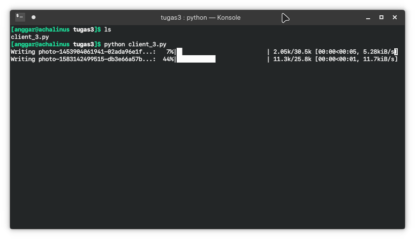
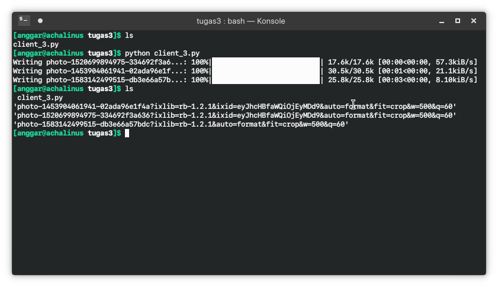

Nama  : Anggar Wahyu Nur W<br>
NRP   : 05111740000052<br>
Kelas : C

### Soal

Pada proses saat pengunduhan gambar ubah menjadi kontruksi menggunakan *thread* 

## Penjelasan Kode

```py
for i in gambars:
    t = threading.Thread(target=download_gambar, args=(i,))
    t.start()
```
Untuk menampilkan tampilan memuat pada terminal gunakan pustaka `tqdm`. Cara penggunaannya dapat menggunakan *context manager* pada python (menggunakan sintaks `with`) seperti berikut

```py
with tqdm(total=total_size, unit='iB', unit_scale=True) as t:
    # ...
```

Kemudian saat akan menulisnya ke berkas, proses penulisan dilakukan dengan *batch* dengan ukuran blok bit yang telah ditentukan. Selain itu, perbarui konteks tqdm pada variabel `t`.

```py
with open(f"{namafile}","wb") as fp:
    for data in ff.iter_content(BLOCK_SIZE):
        t.update(len(data))
        fp.write(data)
```

Keunggulan dalam penggunaan *context manager* pada python adalah kita tidak perlu melepas *resource* yang kita butuhkan dalam program. Semisal untuk perintah pembukaan berkas, kita tidak perlu memanggil metode `close()` setiap kita selesai membuka berkas, selama program telah keluar dari blok `with`, resource akan otomatis terlepas.

## Tangkapan Layar


*Fig 1. Pengunduhan dengan informasi progres pengunduhan saat itu*


*Fig 1. Pengunduhan selesai*