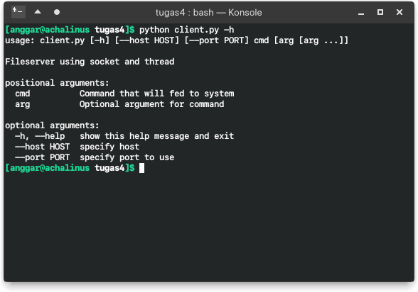
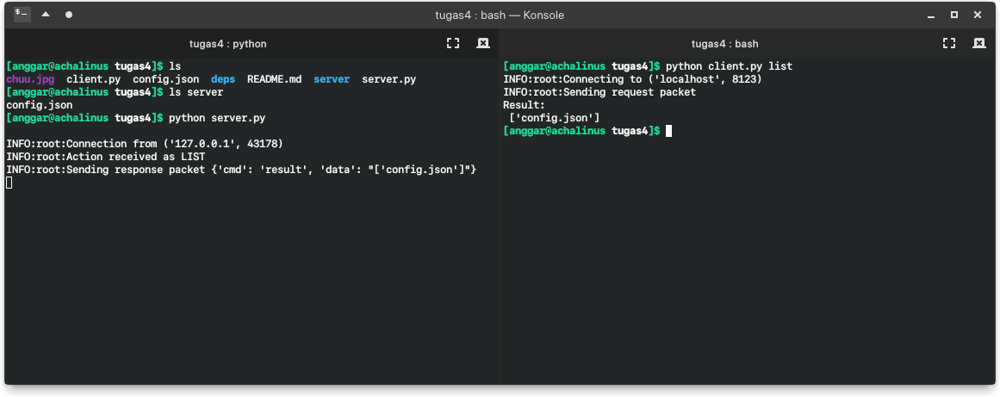
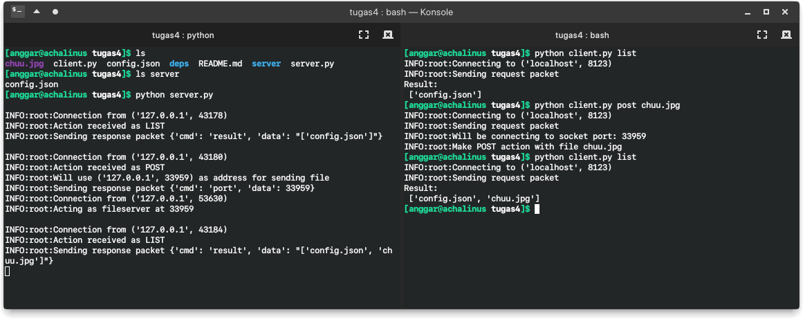
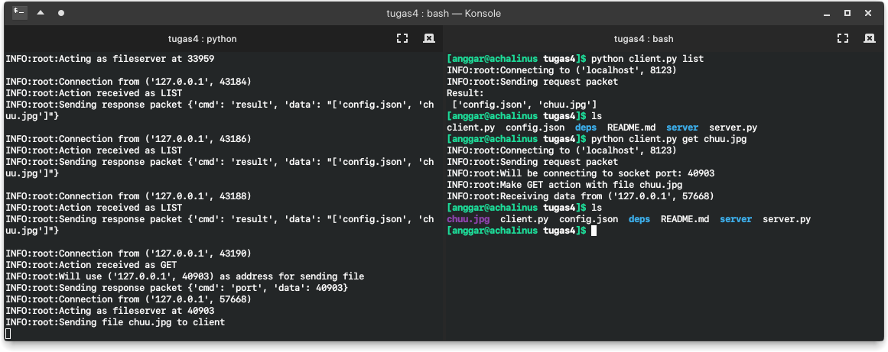
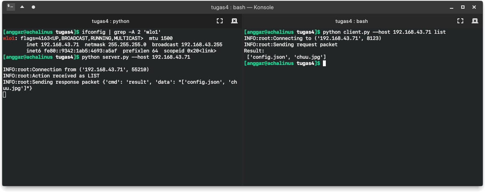
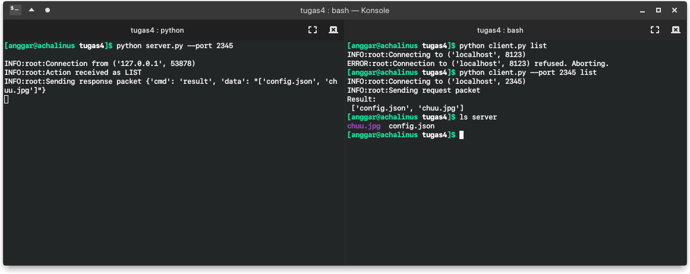

# Pemrograman Jaringan

> Anggar Wahyu Nur W.

> 05111740000052

> Pemrograman jaringan C

## Protokol

Sarana komunikasi antara klien dan server akan menggunakan format JSON dengan format

```json
{"cmd": "command", "data": "data"}
```

Dalam program ini, representasi data tersebut dalam _python_ akan diwakilkan oleh kelas `Packet`.

## Fitur

+ Meletakkan berkas
+ Mengambil berkas
+ Melihat daftar berkas

## Tata Cara

Dokumentasi lebih lengkap dapat dilihat dengan memberikan argumen `-h` atau `--help` saat menjalankan program.



```sh
python3 client.py [OPTION]... COMMAND [COMMAND_ARG] 
```

#### Options

+ `--host` alamat *host* yang dipakai
+ `--post` *port* yang digunakan

#### Command & Arguments

+ `list` tidak diikuti apapun
+ `get` diikuti berkas yang akan diambil dari server
+ `post` diikuti berkas yang akan dikirim ke server

#### Request

Format sesuai dengan protokol yang disetujui di atas. Dalam hal ini, `cmd` bisa memiliki beberapa kemungkinan seperti `list`, `post`, dan `get`. Sedangkan `data` mengikuti jenis `cmd` yang diberikan. 

Untuk perintah `post` dan `get` data perlu diisi dengan nama file yang akan diproses. Contoh _request_ yang akan dilakukan sebagai berikut

```json
{"cmd": "post", "data": "chuu.jpg"}
```

Namun, untuk proses `list` kita tidak perlu memberikan argumen apapun. Contoh _request_ yang akan dilakukan sebagai berikut

```json
{"cmd": "list", "data": ""}
```

#### Response

Format _response_ juga sesuai dengan protokol sebelumnya. Hanya saja nilai dari `cmd` berupa `result` atau `port`. 

Respon yang memiliki `cmd` berupa `result` adalah hasil dari _request_ `list`. Nantinya akan diperoleh respon dengan `data` berupa hasil pemrosesan. Contoh respon yang dimaksud seperti berikut

```json
{"cmd": "result", "data": "['placeholder.txt']"}
```

Sedangkan untuk respon dari permintaan `get` dan `post`,`cmd` akan berisi `post`.  Nantinya, nilai `data` akan berisi suatu angka yang berupa angka _port_ yang bisa digunakan untuk melakukan transaksi berkas (_file_). Contoh respon yang sesuai akan berupa

```json
{"cmd": "port", "data": "8654"}
```

## Contoh Penggunaan

Penggunaan dapat dilakukan dengan menjalankan `server.py` terlebih dahulu, diikuti dengan melakukan perintah di `client.py`.


### List

Pada klien, untuk perintah

```sh
python server.py list
```

akan diperoleh daftar berkas yang ada



### Post

Untuk pengunggahan berkas, lakukan perintah

```sh
python server.py post [nama_file]
```

akan diperoleh respon kurang lebih



> Lihat di hasil `list` sebelumnya tidak ada berkas `chuu.jpg`. Setelah dilakukan pengunduhan, berkas tersebut ada di daftar.

### Get

Untuk pengunduhan berkas, lakukan perintah

```sh
python server.py get [nama_file]
```

akan diperoleh respon kurang lebih



> Lihat di folder utama tidak ada berkas `chuu.jpg`. Setelah dilakukan pengunduhan, berkas tersebut muncul di sana.

### Dengan Opsi

Untuk melakukan komunikasi dengan alamat _host_ yang berbeda bisa dilakukan dengan

```sh
python server.py --host [host] cmd [args ...]
```

akan diperoleh respon kurang lebih



Untuk melakukan komunikasi dengan alamat _host_ yang berbeda bisa dilakukan dengan

```sh
python server.py --port [port] cmd [args ...]
```

akan diperoleh respon kurang lebih



> Lihat sebelumnya, koneksi ditolak karena *port* tidak sesuai. 