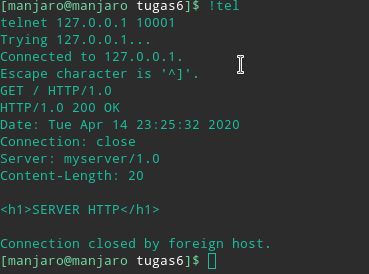
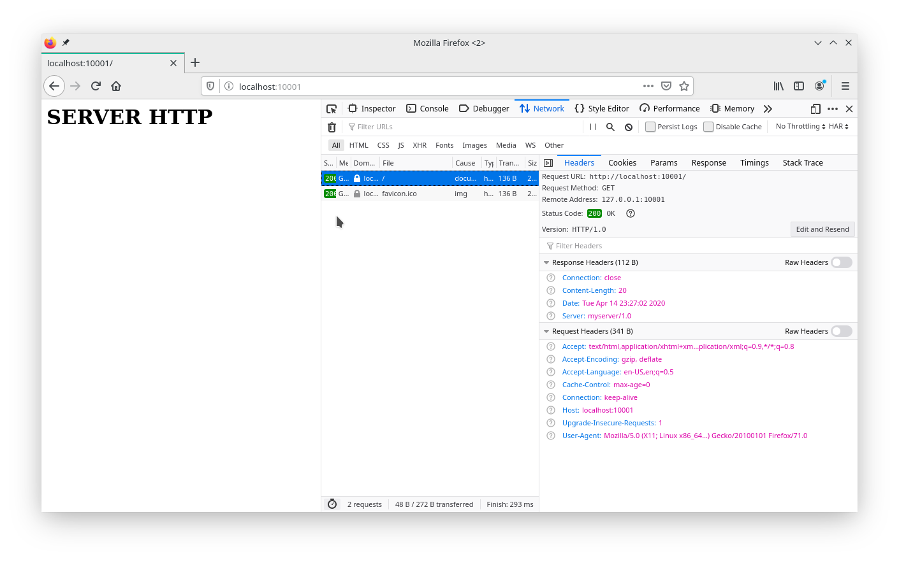

# Tugas 6

> Anggar Wahyu Nur W

> 05111740000052

> Pemrograman Jaringan C

## 1. Multithreaded server

Server dibuat pada berkas `httpserv.py`. Server dijalankan dari berkas tersebut.

## 2. Melayani request dari rupa string

String request akan diolah di `http.py` pada metode `proses()`.

## 3. Tanda akhir request `\r\n\r\n`

Request tidak diharuskan memiliki format tersebut, namun nantinya akan ditambahkan ke servernya.

## 4. Balasan String

Diimplementasikan pada `http.py` pada metode `get()` yang sebelumnya dipanggil oleh metode `proses()`.

## 5. Telnet ke 127.0.0.1:10001

Dengan melakukan telnet diperoleh hasil balasan berupa

## 6. Respon di browser

Dengan membuka browser dan mengaktifkan tab inspeksi diperoleh hasil di bawah.

