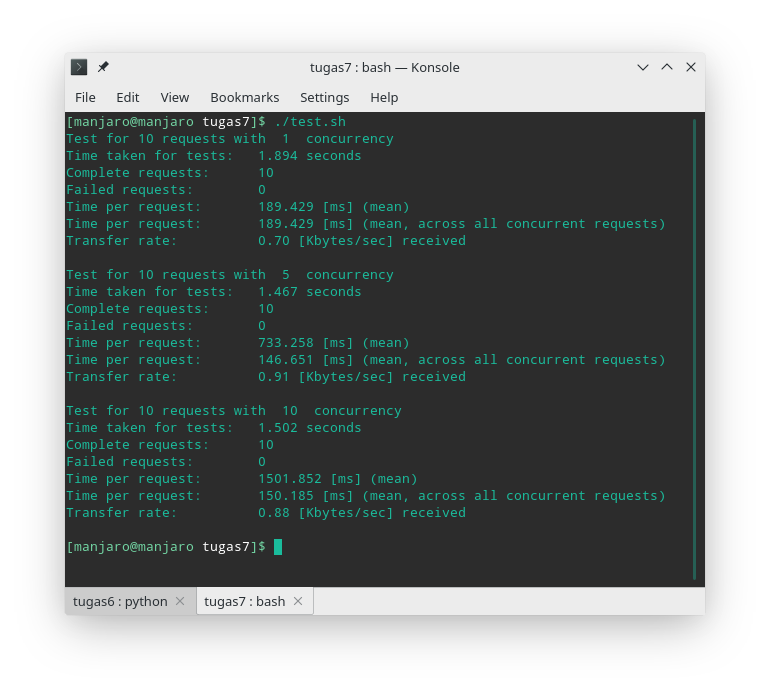

# Tugas 7

## Benchmarking

Benchmarking menggunakan `apachebencmark`. Test script ada di berkas `test.sh`. Hasil dapat dilihat di `result.txt`

## Result

### 10 Requests

| # | Concurrency level | Time taken for test | Complete request | Failed request | Total transferred | Requests per second  | Time per request | Transfer rate     |
|---|-------------------|---------------------|------------------|----------------|-------------------|----------------------|------------------|-------------------|
| 1 | 1                 | 0.025 seconds | 10 | 0 | 1360 bytes | 407.45 [#/sec] (mean) | 2.454 [ms] | 54.11 [Kbytes/sec] |
| 2 | 5                 | 0.048 seconds | 10 | 0 | 1360 bytes | 208.17 [#/sec] (mean) | 4.804 [ms] | 27.65 [Kbytes/sec] |
| 3 | 10                | 0.073 seconds | 10 | 0 | 1360 bytes | 137.42 [#/sec] (mean) | 7.277 [ms] | 18.25 [Kbytes/sec] |

### 50 Requests

| # | Concurrency level | Time taken for test | Complete request | Failed request | Total transferred | Requests per second  | Time per request | Transfer rate     |
|---|-------------------|---------------------|------------------|----------------|-------------------|----------------------|------------------|-------------------|
| 1 | 1                 | 0.585 seconds | 50 | 0 | 6800 bytes | 85.43 [#/sec] (mean) | 11.706 [ms] | 11.35 [Kbytes/sec] |
| 2 | 10                | 0.757 seconds | 50 | 0 | 6800 bytes | 66.05 [#/sec] (mean) | 15.141 [ms] | 8.77 [Kbytes/sec] |
| 3 | 30                | 1.052 seconds | 50 | 0 | 6800 bytes | 47.52 [#/sec] (mean) | 21.045 [ms] | 6.31 [Kbytes/sec] |
| 4 | 50                | 3.306 seconds | 50 | 0 | 6800 bytes | 15.13 [#/sec] (mean) | 66.115 [ms] | 2.01 [Kbytes/sec] |

### 100 Requets

| # | Concurrency level | Time taken for test | Complete request | Failed request | Total transferred | Requests per second  | Time per request | Transfer rate     |
|---|-------------------|---------------------|------------------|----------------|-------------------|----------------------|------------------|-------------------|
| 1 | 1                 | 6.413 seconds | 100 | 0 | 13600 bytes | 15.59 [#/sec] (mean) | 64.133 [ms] | 2.07 [Kbytes/sec] |
| 2 | 10                | 5.041 seconds | 100 | 0 | 13600 bytes | 19.84 [#/sec] (mean) | 50.413 [ms] | 2.63 [Kbytes/sec] |
