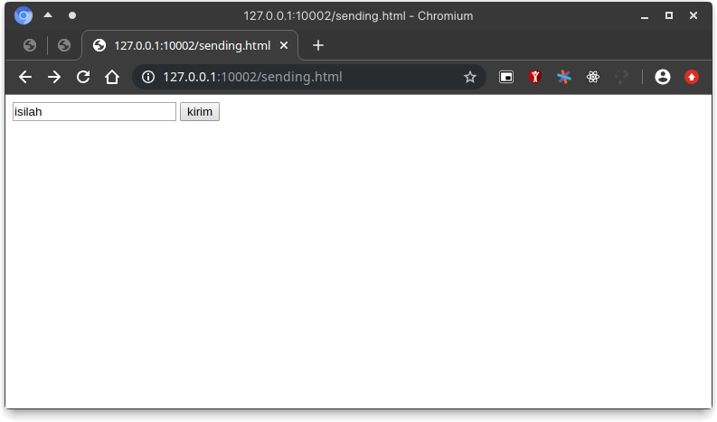
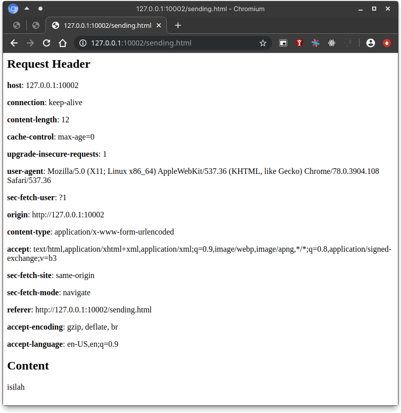

# Tugas 8

> Anggar Wahyu Nur W

> 05111740000052

> Pemrograman Jaringan C

## Riwayat Modifikasi

Membuat kelas `Request` agar nantinya setiap request yang masuk akan diubah menjadi objek tersebut. Dimaksudkannya pengubahan tersebut, agar lebih mudah mengolah request yang masuk. Pengolahan pertama adalah dengan membaca keseluruhan headers lalu dimasukkan ke `Request.headers`, kemudian membaca body jika ada dan memasukkannya ke `Request.body`. Jika sudah kita passing objek `Request` tersebut ke fungsi `proses()` di `http.py`. Setelah itu agar lebih cantik, kita olah berkas tersebut dengan menggenerasi berkas html dan berikan *tag* yang sesuai seperti `h1` dan `p`.

## Tangkapan Layar

### Pengisian Formulir

### Penampilan Konten

